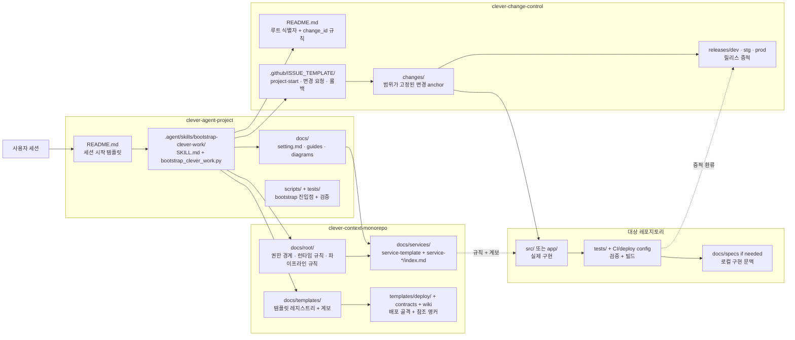
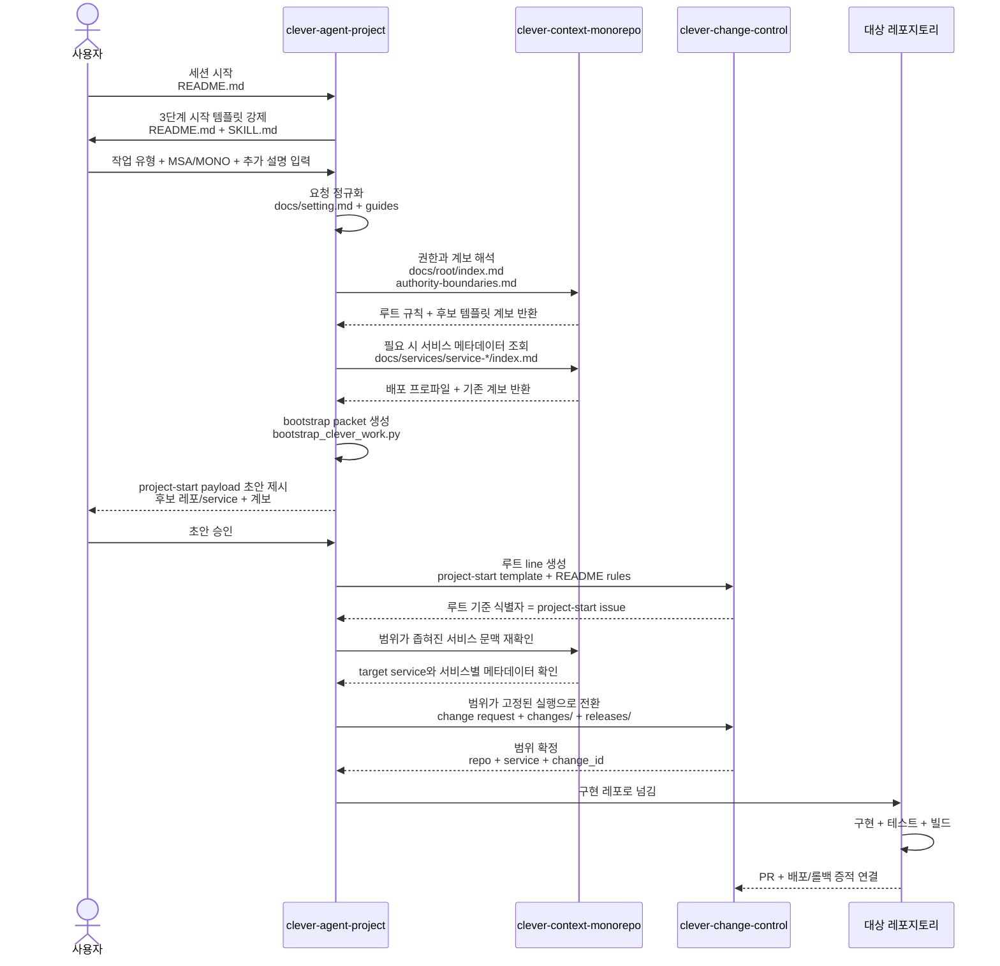
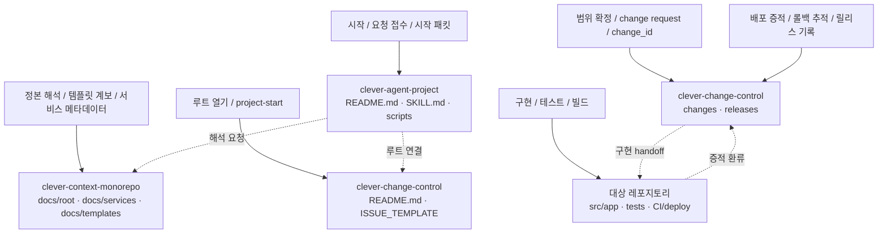

# CLEVER Agent Project

> CLEVER는 단일 레포지토리 에이전트가 아니다.  
> 로컬에 함께 내려받은 3개 레포지토리를 함께 읽고, 이후 실제 구현 대상 레포지토리로 실행을 넘기는 워크스페이스 우선 제어 평면 런타임이다.

## 워크스페이스 레포지토리

- [`clever-agent-project`](https://github.com/EVNSolution/clever-agent-project): 시작점, 요청 접수, 시작 패킷 생성
- [`clever-context-monorepo`](https://github.com/EVNSolution/clever-context-monorepo): 해석 정본, 템플릿 계보, 서비스 메타데이터, 배포 기준
- [`clever-change-control`](https://github.com/EVNSolution/clever-change-control): `project-start` 루트, 범위가 고정된 변경 요청, 배포/롤백 추적

## 빠른 링크

- [빠른 시작](#빠른-시작)
- [필수 워크스페이스 계약](#필수-워크스페이스-계약)
- [레포 맵](#레포-맵)
- [시나리오 다이어그램](#시나리오-다이어그램)
- [상세 문서](#상세-문서)
- [관련 레포](#관련-레포)
- [운영 설명서](docs/setting.md)
- [작업 흐름 가이드](docs/guides/clever-project-workflows.md)

## CLEVER란 무엇인가

CLEVER의 실행 단위는 단일 레포가 아니다.

CLEVER는 아래 3개 레포가 **같은 로컬 워크스페이스 루트에 함께 존재하는 상태**를 전제로 동작한다.

1. `clever-agent-project`
2. `clever-context-monorepo`
3. `clever-change-control`

에이전트는 이 세 레포를 함께 읽어서 시작 규칙, 해석 기준, 추적 기준을 합쳐 사용한다.  
그 다음 실제 구현 작업은 별도의 대상 레포지토리로 넘어간다.

## 왜 3개 레포가 모두 필요한가

| 레포지토리 | 책임 | 빠지면 생기는 문제 |
| --- | --- | --- |
| `clever-agent-project` | 시작점, 요청 접수, 시작 패킷 생성 | 작업 시작은 가능하지만 해석과 추적이 분리되지 않아 제어 평면이 성립하지 않음 |
| `clever-context-monorepo` | 규칙, 템플릿 계보, 서비스 메타데이터, 배포 기준 | 정본 해석이 사라지고 서비스 문맥 판단 품질이 크게 떨어짐 |
| `clever-change-control` | `project-start` 루트, 범위가 고정된 변경 요청, 배포/롤백 추적 | 루트 이슈, 변경 식별자, ledger 연결이 사라짐 |

짧게 말하면:

- `clever-agent-project`는 시작을 연다.
- `clever-context-monorepo`는 해석을 제공한다.
- `clever-change-control`은 승인과 추적을 남긴다.
- 실제 구현은 대상 레포지토리에서 수행한다.

## 필수 워크스페이스 계약

CLEVER를 제대로 실행하려면 아래 조건이 먼저 만족되어야 한다.

- 3개 레포가 같은 로컬 워크스페이스 루트에 있어야 한다.
- 에이전트가 세 레포의 로컬 파일을 직접 읽을 수 있어야 한다.
- 웹 링크만으로는 충분하지 않다.
- 3개 중 하나라도 없으면 실행 품질이 크게 저하된다.

즉, 현재 CLEVER는 **단일 레포 런타임이 아니라 3레포 로컬 워크스페이스 런타임**이다.

## 빠른 시작

### 1. 로컬 워크스페이스 준비

먼저 같은 로컬 루트 아래에 아래 3개 레포를 준비한다.

- `clever-agent-project`
- `clever-context-monorepo`
- `clever-change-control`

### 2. 세션 시작

세션은 항상 `clever-agent-project`에서 시작한다.

기본 시작 템플릿은 아래와 같다.

```text
[작업 시작]
1. 새 서비스 개발 vs. 기존 서비스 추가:
2. 서비스 기반 (MSA vs. MONO):
3. 타입 명확하게 분류하기:

추가 설명
- 하려는 일:
- 왜 필요한지:
- 제약:
- 기대 결과:
- 관련 repo/service가 있으면:
```

운영 규칙은 아래와 같다.

- 첫 질문은 반드시 위 3단계로 시작한다.
- `change-control`의 내부 타입 분류는 에이전트가 해석한다.
- `project-start` 초안, repo bootstrap, 구현 계획은 위 템플릿과 추가 설명이 충분히 채워지기 전에는 진행하지 않는다.

### 3. 실행 흐름

1. `clever-agent-project`에서 작업 시작
2. `clever-context-monorepo`에서 규칙, 템플릿 계보, 서비스 메타데이터 해석
3. `clever-change-control`에서 `project-start` 루트와 범위가 고정된 실행 추적 연결
4. 대상 레포지토리로 넘긴 뒤 구현, 검증, 배포 진행

## 레포 맵

| 레포지토리 | 역할 | 대표 위치 |
| --- | --- | --- |
| `clever-agent-project` | 시작점, 요청 접수, bootstrap, handoff 안내 | `README.md`, `.agent/skills/bootstrap-clever-work/`, `docs/`, `scripts/`, `tests/` |
| `clever-context-monorepo` | 해석 정본, 템플릿 계보, 서비스 메타데이터, 배포 기준 | `docs/root/`, `docs/services/`, `docs/templates/`, `templates/deploy/`, `contracts/` |
| `clever-change-control` | `project-start` 루트, 범위가 고정된 변경 요청, 배포/롤백 추적 | `README.md`, `.github/ISSUE_TEMPLATE/`, `changes/`, `releases/` |
| 대상 레포지토리 | 실제 구현, 테스트, 빌드, 배포 | `src/` 또는 `app/`, `tests/`, `.github/`, 배포/런타임 설정 |

## 시나리오 다이어그램

아래 다이어그램은 저장소 화면에서 바로 읽을 수 있는 Markdown + Mermaid 기준이다.

- [다이어그램 인덱스](docs/diagrams/README.md)
- [3레포 제어 평면 개요](docs/diagrams/clever-control-plane-overview.md)
- [세션 시작부터 대상 레포지토리 실행까지](docs/diagrams/clever-work-lifecycle.md)
- [3레포 책임 분담도](docs/diagrams/clever-repository-responsibility-map.md)
- [상세 디렉터리 맵](docs/diagrams/clever-repo-directory-map.md)

### README에서 바로 펼쳐보기

<details>
<summary>3레포 제어 평면 개요</summary>



</details>

<details>
<summary>세션 시작부터 대상 레포지토리 실행까지</summary>



</details>

<details>
<summary>3레포 책임 분담도</summary>



</details>

상세 디렉터리 구조는 별도 문서에서 본다.

- [3레포 디렉터리 맵](docs/diagrams/clever-repo-directory-map.md)

## 상세 문서

- [운영 설명서](docs/setting.md): 설치, 인증, bootstrap helper, 폴더 역할을 포함한 운영 설명
- [작업 흐름 가이드](docs/guides/clever-project-workflows.md): 신규 시작, 기존 서비스 변경, handoff 흐름
- [다이어그램 인덱스](docs/diagrams/README.md): 저장소 화면용 구조/흐름 다이어그램 모음
- [.agent/skills/bootstrap-clever-work/SKILL.md](.agent/skills/bootstrap-clever-work/SKILL.md): 에이전트가 실제로 따르는 시작 규칙

## 핵심 폴더

- [.agent/skills/bootstrap-clever-work/](.agent/skills/bootstrap-clever-work): 시작 규칙과 bootstrap helper 자산
- [docs/](docs): 운영 설명, 가이드, 다이어그램, plan/spec 문서
- [scripts/](scripts): bootstrap / issue sync 같은 로컬 보조 진입점
- [tests/](tests): helper와 규칙 문서 변경 검증

## 관련 레포

- [`clever-agent-project`](https://github.com/EVNSolution/clever-agent-project)
- [`clever-context-monorepo`](https://github.com/EVNSolution/clever-context-monorepo)
- [`clever-change-control`](https://github.com/EVNSolution/clever-change-control)

## 한 줄 정리

CLEVER는 **단일 레포지토리가 아니라, 로컬에 함께 내려받은 3개 레포지토리 워크스페이스 위에서 동작하는 제어 평면 런타임**이다.
