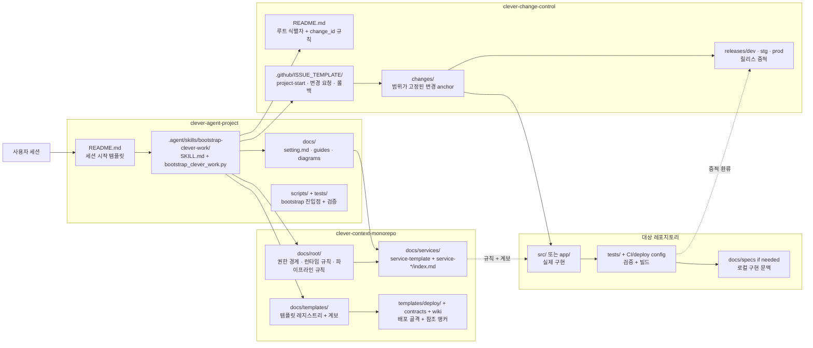
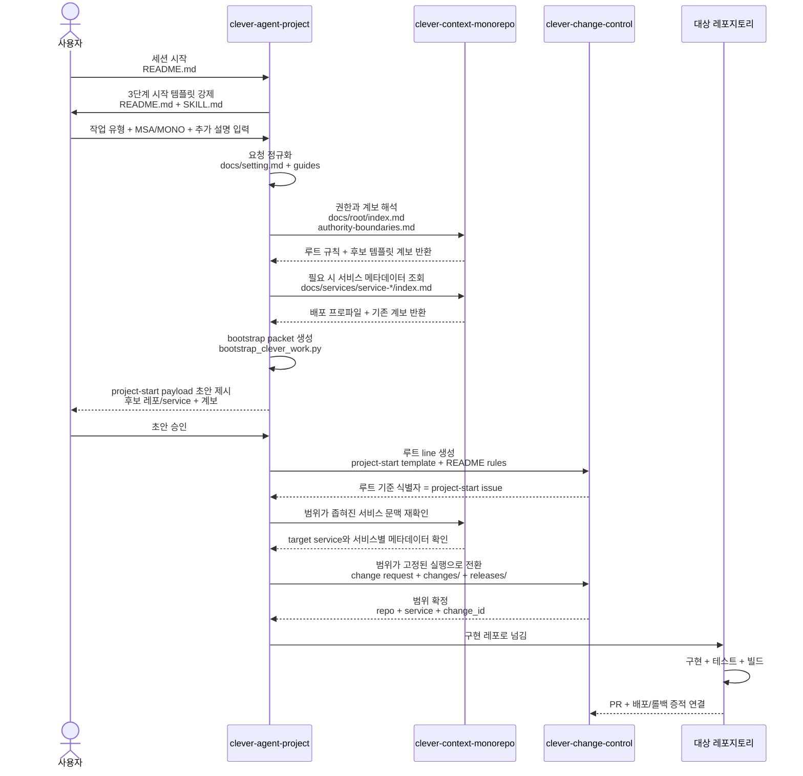
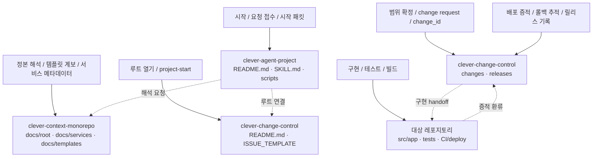

# CLEVER Agent Project

> CLEVER는 단일 레포지토리 에이전트가 아니다.  
> 로컬에 함께 내려받은 3개 레포지토리를 함께 읽고, 이후 실제 구현 대상 레포지토리로 실행을 넘기는 워크스페이스 우선 제어 평면 런타임이다.

## 빠른 시작

아래 박스를 그대로 복사해서 실행한다.

```bash
mkdir -p clever-agent-workspace
cd clever-agent-workspace

git clone https://github.com/EVNSolution/clever-agent-project.git
git clone https://github.com/EVNSolution/clever-context-monorepo.git
git clone https://github.com/EVNSolution/clever-change-control.git

cd clever-agent-project
CLEVER_EXPECTED_GITHUB_LOGIN="<github-login-or-profile-url>" \
  python3 scripts/bootstrap_clever_work.py --cwd "$PWD" --preflight --json
```

에이전트 종류별 실행 예시:

```bash
# Codex
codex --yolo

# Claude Code
claude --dangerously-skip-permissions

# Gemini CLI
gemini --yolo
```

그다음 `clever-agent-project`에서 에이전트 세션을 연다.
첫 메시지는 [시작 입력](#시작-입력)의 양식 또는 자연어 예시를 사용한다.

## 시작 입력

아래 양식을 채워도 되고, 자연어로 편하게 설명해도 된다.
혹은 자연어로 편하게 대화하며 진행하세요.
에이전트가 내용을 시작 분기로 다시 정리하고, 부족한 값만 추가로 묻는다.

```text
작업 시작

1. 작업 종류:
- 새 작업 시작
- 기존 서비스 변경
- 현재 저장소 자체 수정

2. 구조:
- MONO
- MSA

3. 이번 세션 목표:
- 요구사항/문서 정의
- 서비스 온보딩 정의
- 구현 repo 작업
- 배포 준비

추가 설명
- 하려는 일:
- 왜 필요한지:
- 제약:
- 기대 결과:
- 알고 있는 repo/service가 있으면:
```

자연어 예시:

```text
회원가입, 로그인, 사용자 확인 기능이 있는 단순한 인증 시스템을 새 프로젝트로 만들고 싶다.
처음에는 MONO 구조로 가고, 새 repo를 만들면서 AGENTS.md와 docs/project-brief.md도 같이 준비해줘.
권한 관리나 소셜 로그인은 나중에 하고, 지금은 기본 인증 흐름만 동작하면 된다.
```

에이전트는 이 입력을 시작 분기로 해석하고, 먼저 startup branch state를 채운 뒤에만 `project-start` 초안, repo bootstrap, 구현 계획으로 내려간다.

## 워크스페이스 레포지토리

- [`clever-agent-project`](https://github.com/EVNSolution/clever-agent-project): 시작점, 요청 접수, 시작 패킷 생성
- [`clever-context-monorepo`](https://github.com/EVNSolution/clever-context-monorepo): 해석 정본, 템플릿 계보, 서비스 메타데이터, 배포 기준
- [`clever-change-control`](https://github.com/EVNSolution/clever-change-control): `project-start` 루트, 범위가 고정된 변경 요청, 배포/롤백 추적

## 빠른 링크

- [빠른 시작](#빠른-시작)
- [시작 입력](#시작-입력)
- [필수 워크스페이스 계약](#필수-워크스페이스-계약)
- [레포 맵](#레포-맵)
- [시나리오 다이어그램](#시나리오-다이어그램)
- [상세 문서](#상세-문서)
- [관련 레포](#관련-레포)
- [운영 설명서](docs/setting.md)
- [작업 흐름 가이드](docs/guides/clever-project-workflows.md)

## CLEVER란 무엇인가

CLEVER의 실행 단위는 단일 레포가 아니다.

CLEVER는 아래 3개 레포가 **같은 로컬 워크스페이스 루트에 함께 존재하는 상태**를 전제로 동작한다.

1. `clever-agent-project`
2. `clever-context-monorepo`
3. `clever-change-control`

에이전트는 이 세 레포를 함께 읽어서 시작 규칙, 해석 기준, 추적 기준을 합쳐 사용한다.  
그 다음 실제 구현 작업은 별도의 대상 레포지토리로 넘어간다.

## 왜 3개 레포가 모두 필요한가

| 레포지토리 | 책임 | 빠지면 생기는 문제 |
| --- | --- | --- |
| `clever-agent-project` | 시작점, 요청 접수, 시작 패킷 생성 | 작업 시작은 가능하지만 해석과 추적이 분리되지 않아 제어 평면이 성립하지 않음 |
| `clever-context-monorepo` | 규칙, 템플릿 계보, 서비스 메타데이터, 배포 기준 | 정본 해석이 사라지고 서비스 문맥 판단 품질이 크게 떨어짐 |
| `clever-change-control` | `project-start` 루트, 범위가 고정된 변경 요청, 배포/롤백 추적 | 루트 이슈, 변경 식별자, ledger 연결이 사라짐 |

짧게 말하면:

- `clever-agent-project`는 시작을 연다.
- `clever-context-monorepo`는 해석을 제공한다.
- `clever-change-control`은 승인과 추적을 남긴다.
- 실제 구현은 대상 레포지토리에서 수행한다.

## 필수 워크스페이스 계약

CLEVER를 제대로 실행하려면 아래 조건이 먼저 만족되어야 한다.

- 3개 레포가 같은 로컬 워크스페이스 루트에 있어야 한다.
- 에이전트가 세 레포의 로컬 파일을 직접 읽을 수 있어야 한다.
- 웹 링크만으로는 충분하지 않다.
- 3개 중 하나라도 없으면 실행 품질이 크게 저하된다.
- `gh` CLI가 설치되어 있고 `gh auth status`가 통과해야 한다.
- 공용 기본 GitHub 계정은 없다. 첫 실행 때 사용자에게 GitHub login 또는 profile URL을 물어보고, `CLEVER_EXPECTED_GITHUB_LOGIN` 또는 `--expected-github-login`으로 명시한 값과 현재 `gh` 계정을 검증한다.
- GitHub 계정이 `EVNSolution` org active member인지 확인한다.
- 세 control-plane repo의 origin은 `EVNSolution/*`이어야 한다.
- 세 control-plane repo는 public이어야 하고 issue, PR, ruleset 조회가 가능해야 한다.

즉, 현재 CLEVER는 **단일 레포 런타임이 아니라 3레포 로컬 워크스페이스 런타임**이다.

## 운영 세부 기준

### Preflight Gate

세션을 시작하기 전에 에이전트는 사용자에게 GitHub login 또는 profile URL을 물어본 뒤 아래 명령으로 로컬 3레포, `gh auth status`, GitHub login, 원격 접근, issue/PR/ruleset 조회 가능 여부를 자동 감지한다.

```bash
CLEVER_EXPECTED_GITHUB_LOGIN="<github-login-or-profile-url>" \
  python3 scripts/bootstrap_clever_work.py --cwd "$PWD" --preflight --json
```

현재 control-plane 저장소 자체를 직접 수정하는 세션이면 아래처럼 유지보수 모드로 확인한다.

```bash
CLEVER_EXPECTED_GITHUB_LOGIN="<github-login-or-profile-url>" \
  python3 scripts/bootstrap_clever_work.py --cwd "$PWD" --preflight --current-repo-maintenance --json
```

반환된 `preflight_check.ready`가 `false`면 시작 템플릿으로 내려가지 않는다.
`true`이면 내부 `workspace_check.agent_action`을 읽는다.
`proceed-with-hard-gate`면 그대로 시작 템플릿으로 진행하고, `current-repo-maintenance`면 현재 control-plane 저장소를 직접 수정하는 세션으로 보고 여기서 계속하며, `switch-to-clever-agent-project`면 시작 위치를 옮기고, `stop-and-fix-workspace`면 누락된 레포를 먼저 보완한다.

repo 생성, ruleset 적용, 보호 설정처럼 GitHub admin 권한이 필요한 작업 직전에는 대상 repo를 지정해 admin preflight를 다시 통과해야 한다.
새 repo 생성 권한은 destructive create 없이 완전히 증명할 수 없으므로, preflight는 org membership과 token/API 접근을 먼저 확인하고 실제 생성 성공은 `gh repo create` 결과로 확정한다.

```bash
CLEVER_EXPECTED_GITHUB_LOGIN="<github-login-or-profile-url>" \
  python3 scripts/bootstrap_clever_work.py \
  --cwd "$PWD" \
  --admin-preflight \
  --target-repo-full-name EVNSolution/<target-repo> \
  --json
```

### 새 프로젝트 repo visibility

새 프로젝트 repo는 public으로 만든다.
GitHub Free 조직에서 private repo ruleset이 enforce되지 않는다.
ruleset 기반으로 `main`/`dev` direct push를 막고 PR 필수 정책을 쓰려면 새 target repo를 public으로 생성한다.

### control-plane repo 보호 기준

3개 control-plane repo는 public으로 운영한다.

- `clever-agent-project`
- `clever-context-monorepo`
- `clever-change-control`

각 repo의 `main`은 GitHub ruleset `CLEVER protect main`으로 보호한다.

- `main` direct push 금지
- `main` 삭제 금지
- force push 금지
- `main` 변경은 PR 필수
- PR 필수지만 승인 수는 0명
- merge/write는 repo admin 권한자만 수행
- admin bypass는 `pull_request` 모드만 허용

`main` merge commit 제목은 PR merge임이 드러나게 아래 형식을 쓴다.

```text
Merge pull request #<pr-number> from <owner>/<source-branch>
```

### 세션 시작

generic CLEVER startup은 `clever-agent-project`에서 시작한다.

다만 아래처럼 현재 control-plane 레포 자체를 직접 수정하는 세션은 예외다.

- `clever-context-monorepo` 정본 문서/규칙 수정
- `clever-change-control` issue template/traceability 규칙 수정

이 경우에는 해당 레포에서 세션을 열 수 있지만, 먼저 `preflight`를 돌려 generic startup이 아니라 repo-local maintenance인지 확인한다.

운영 규칙은 아래와 같다.

- 첫 질문은 반드시 위 3단계로 시작한다.
- 에이전트는 답변을 [startup branch state template](docs/templates/startup-branch-state-template.md)로 먼저 정규화한다.
- `change-control`의 내부 타입 분류는 에이전트가 해석한다.
- `project-start` 초안, repo bootstrap, 구현 계획은 위 템플릿과 추가 설명이 충분히 채워지기 전에는 진행하지 않는다.

### 실행 흐름

1. `clever-agent-project`에서 작업 시작
2. `clever-context-monorepo`에서 규칙, 템플릿 계보, 서비스 메타데이터 해석
3. `clever-change-control`에서 `project-start` 루트와 범위가 고정된 실행 추적 연결
4. 대상 레포지토리로 넘긴 뒤 구현, 검증, 배포 진행

## 레포 맵

| 레포지토리 | 역할 | 대표 위치 |
| --- | --- | --- |
| `clever-agent-project` | 시작점, 요청 접수, bootstrap, handoff 안내 | `README.md`, `.agent/skills/bootstrap-clever-work/`, `docs/`, `scripts/`, `tests/` |
| `clever-context-monorepo` | 해석 정본, 템플릿 계보, 서비스 메타데이터, 배포 기준 | `docs/root/`, `docs/services/`, `docs/templates/`, `templates/deploy/`, `contracts/` |
| `clever-change-control` | `project-start` 루트, 범위가 고정된 변경 요청, 배포/롤백 추적 | `README.md`, `.github/ISSUE_TEMPLATE/`, `changes/`, `releases/` |
| 대상 레포지토리 | 실제 구현, 테스트, 빌드, 배포 | `src/` 또는 `app/`, `tests/`, `.github/`, 배포/런타임 설정 |

## 시나리오 다이어그램

아래 다이어그램은 저장소 화면에서 바로 읽을 수 있는 Markdown + Mermaid 기준이다.

- [다이어그램 인덱스](docs/diagrams/README.md)
- [3레포 제어 평면 개요](docs/diagrams/clever-control-plane-overview.md)
- [세션 시작부터 대상 레포지토리 실행까지](docs/diagrams/clever-work-lifecycle.md)
- [3레포 책임 분담도](docs/diagrams/clever-repository-responsibility-map.md)
- [상세 디렉터리 맵](docs/diagrams/clever-repo-directory-map.md)

### README에서 바로 펼쳐보기

<details>
<summary>3레포 제어 평면 개요</summary>



</details>

<details>
<summary>세션 시작부터 대상 레포지토리 실행까지</summary>



</details>

<details>
<summary>3레포 책임 분담도</summary>



</details>

상세 디렉터리 구조는 별도 문서에서 본다.

- [3레포 디렉터리 맵](docs/diagrams/clever-repo-directory-map.md)

## 상세 문서

- [운영 설명서](docs/setting.md): 설치, 인증, bootstrap helper, 폴더 역할을 포함한 운영 설명
- [작업 흐름 가이드](docs/guides/clever-project-workflows.md): 신규 시작, 기존 서비스 변경, handoff 흐름
- [세션 시작 스모크 테스트](docs/guides/session-start-smoke-test.md): 새 세션이 시작 하드 게이트를 제대로 따르는지 확인하는 운영 시나리오
- [3레포 시작 모델 정합성 정리](docs/guides/three-repo-startup-alignment.md): 현재 정본 기준, 어긋남, 덜 작성된 점을 한 번에 정리한 문서
- [다이어그램 인덱스](docs/diagrams/README.md): 저장소 화면용 구조/흐름 다이어그램 모음
- [.agent/skills/bootstrap-clever-work/SKILL.md](.agent/skills/bootstrap-clever-work/SKILL.md): 에이전트가 실제로 따르는 시작 규칙

## 핵심 폴더

- [.agent/skills/bootstrap-clever-work/](.agent/skills/bootstrap-clever-work): 시작 규칙과 bootstrap helper 자산
- [docs/](docs): 운영 설명, 가이드, 다이어그램, plan/spec 문서
- [scripts/](scripts): bootstrap / issue sync 같은 로컬 보조 진입점
- [tests/](tests): helper와 규칙 문서 변경 검증

## 관련 레포

- [`clever-agent-project`](https://github.com/EVNSolution/clever-agent-project)
- [`clever-context-monorepo`](https://github.com/EVNSolution/clever-context-monorepo)
- [`clever-change-control`](https://github.com/EVNSolution/clever-change-control)

## 한 줄 정리

CLEVER는 **단일 레포지토리가 아니라, 로컬에 함께 내려받은 3개 레포지토리 워크스페이스 위에서 동작하는 제어 평면 런타임**이다.
