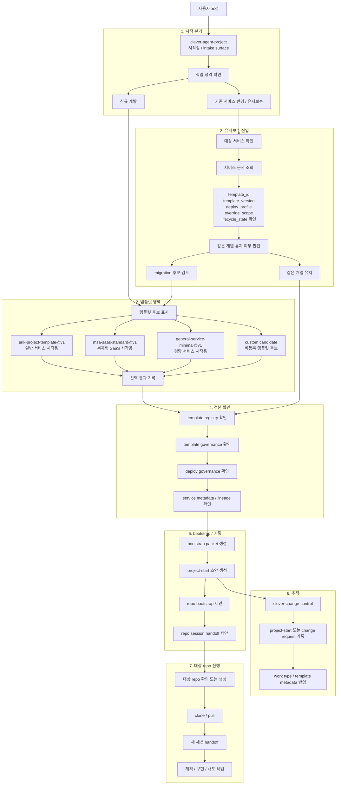

# clever-agent-project

CLEVER 작업을 시작할 때 가장 먼저 여는 intake / bootstrap 포털이다.

이 레포는 구현 저장소가 아니라, 작업 성격을 분기하고, 템플릿 선택을 정리하고, `project-start` 초안과 handoff 방향을 잡는 시작점이다. 상세 설정과 운영 절차는 [docs/setting.md](docs/setting.md)에서 다룬다.

## 바로가기

- [세션 시작 템플릿](#세션-시작-템플릿)
- [시나리오 다이어그램](#시나리오-다이어그램)
- [Three-repo control plane overview](docs/diagrams/clever-control-plane-overview.md)
- [Session start to target-repo execution](docs/diagrams/clever-work-lifecycle.md)
- [Three-repo directory map](docs/diagrams/clever-repo-directory-map.md)
- [clever-context-monorepo](https://github.com/EVNSolution/clever-context-monorepo)
- [clever-change-control](https://github.com/EVNSolution/clever-change-control)

## 세션 시작 템플릿

새 세션은 아래 템플릿으로 시작하는 것을 기본값으로 둔다. 사용자는 이 블록을 그대로 붙여 넣어도 되고, 자유문으로 시작해도 된다. 자유문으로 시작한 경우에도 에이전트는 같은 구조로 다시 정리해 받아야 한다.

```text
[작업 시작]
1. 새 서비스 개발 vs. 기존 서비스 추가:
2. 서비스 기반 (MSA vs. MONO):
3. 타입 명확하게 분류하기:

추가 설명
- 하려는 일:
- 왜 필요한지:
- 제약:
- 기대 결과:
- 관련 repo/service가 있으면:
```

운영 규칙은 아래와 같다.

- 첫 질문은 반드시 위 3단계로 시작한다.
- `change-control`의 내부 타입 분류는 에이전트가 해석한다.
- `project-start` 초안, repo bootstrap, 구현 계획은 위 템플릿과 추가 설명이 충분히 채워지기 전에는 진행하지 않는다.

## 시나리오 다이어그램

- [Scenario Diagrams](docs/diagrams/README.md)
- [Three-repo control plane overview](docs/diagrams/clever-control-plane-overview.md)
- [Session start to target-repo execution](docs/diagrams/clever-work-lifecycle.md)
- [Three-repo directory map](docs/diagrams/clever-repo-directory-map.md)

## 빠른 이해

| 저장소 | 역할 | 다음에 읽을 위치 |
| --- | --- | --- |
| `clever-agent-project` | 시작점, intake, bootstrap, handoff 안내 | [README.md](README.md), [docs/setting.md](docs/setting.md) |
| `clever-context-monorepo` | 해석 정본, 템플릿, 서비스 메타, 배포 기준 | [authority boundaries](https://github.com/EVNSolution/clever-context-monorepo/blob/main/docs/root/authority-boundaries.md), [template registry](https://github.com/EVNSolution/clever-context-monorepo/blob/main/docs/templates/index.md) |
| `clever-change-control` | `project-start` root, scoped change request, 승인과 추적 | [README](https://github.com/EVNSolution/clever-change-control/blob/main/README.md), [project-start template](https://github.com/EVNSolution/clever-change-control/blob/main/.github/ISSUE_TEMPLATE/project-start.yml) |

## 신규 개발 시작

신규 개발은 템플릿 후보를 먼저 보고 고른 뒤 시작한다. 선택한 `template_id`, `template_version`, `deploy_profile`이 bootstrap packet과 이후 서비스 메타의 기준이 된다.

- 시작 위치: `clever-agent-project`
- 첫 앵커: 템플릿 후보 검토
- 다음 정본: `clever-context-monorepo`의 template registry / deploy governance
- 이후 흐름: `project-start` 초안 생성 -> 승인 -> `clever-change-control`의 root issue 기록 -> 대상 repo handoff

## 기존 서비스 변경

변경이나 유지보수는 바로 구현으로 들어가지 않는다. 먼저 서비스 메타를 읽고, 기존 템플릿 계보와 배포 프로파일을 확인한 뒤 같은 계열 유지인지 `migration`인지 판단한다.

- 시작 위치: `clever-agent-project`
- 첫 앵커: 서비스 문서의 `template_id`, `template_version`, `deploy_profile`, `override_scope`, `lifecycle_state`
- 다음 정본: `clever-context-monorepo/docs/services/<service>/index.md`
- 이후 흐름: 동일 계열 유지 또는 migration 판단 -> root issue 확인 -> scoped change request 정리 -> 대상 repo handoff

## 템플릿 영역

아래는 시작 시 사용자에게 보여줄 템플릿 선택 영역의 기준 자리다. 신규 개발은 여기서 후보를 보고 선택하고, 유지보수는 기존 서비스 메타를 먼저 읽은 뒤 필요하면 여기서 migration 후보를 다시 본다.

| 템플릿 | 용도 | 배포 방식 | 상태 | 상세 |
| --- | --- | --- | --- | --- |
| `erik-project-template@v1` | 일반 서비스 시작용 예시 | 표준 웹/서비스 배포 기준 | `recommended` | [registry entry](https://github.com/EVNSolution/clever-context-monorepo/blob/main/docs/templates/test-erik-project-template/index.md) |
| `msa-saas-standard@v1` | 복제형 SaaS 시작용 예시 | 고객사별 이미지 분기 운영 | `candidate` | registry 연결 예정 |
| `general-service-minimal@v1` | 경량 서비스 시작용 예시 | 단일 서비스 기준 | `candidate` | registry 연결 예정 |
| `custom candidate` | 비등록 템플릿 후보 | 선택 후 메타 기록 필요 | `candidate` | 사용자 지정 |

짧게 정리하면 아래와 같다.

- 신규는 여기서 템플릿을 보고 고른다.
- 유지보수는 기존 서비스 메타를 먼저 읽고, 필요하면 여기서 migration 후보를 다시 본다.

## 전체 흐름도

<details>
<summary>신규 개발 / 유지보수 / 템플릿 선택 / handoff 흐름 보기</summary>



</details>

## 핵심 폴더

- [.agent/skills/bootstrap-clever-work/](.agent/skills/bootstrap-clever-work): 에이전트가 CLEVER 작업을 시작할 때 따르는 bootstrap 규칙과 helper 자산
- [docs/](docs): 설정 문서, workflow 가이드, 템플릿 문서, spec/plan 기록
- [scripts/](scripts): bootstrap / issue sync 같은 repo-local 보조 진입점
- [tests/](tests): helper와 규칙 문서 변경을 검증하는 테스트

## 상세 문서

- [docs/setting.md](docs/setting.md): 설치, 인증, bootstrap helper, 폴더 역할까지 포함한 운영 설명서
- [docs/guides/clever-project-workflows.md](docs/guides/clever-project-workflows.md): 새 프로젝트 시작 / 기존 repo 개선 / 재구현 시나리오 가이드
- [.agent/skills/bootstrap-clever-work/SKILL.md](.agent/skills/bootstrap-clever-work/SKILL.md): 에이전트가 실제로 따라야 하는 시작 규칙

## 운영 메모

- 이 저장소는 `main` 기준 direct push 운영을 기본으로 한다.
- 일반적인 구현 저장소가 아니라 intake와 orchestration surface 역할을 가진다.
- 시작 절차의 상세 규칙은 이 `README.md`보다 [docs/setting.md](docs/setting.md)와 SSOT repo 문서를 우선한다.
