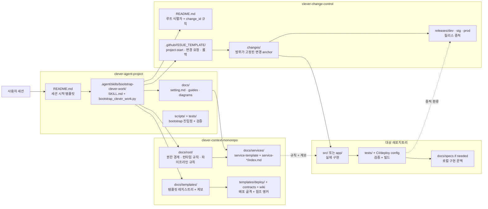

# 3레포 제어 평면 개요

저장소 화면에서 바로 읽는 용도의 구조도다. `clever-agent-project`가 시작점을 열고, `clever-context-monorepo`가 해석 정본을 제공하고, `clever-change-control`이 루트와 범위 추적을 남긴 뒤, 실제 구현은 대상 레포지토리로 넘어간다.

## 읽는 법

- `clever-agent-project`는 사용자 요청을 intake하고 bootstrap packet을 만든다.
- `clever-context-monorepo`는 루트 규칙, 서비스 메타데이터, 템플릿 계보를 해석한다.
- `clever-change-control`은 `project-start issue #`와 범위가 고정된 변경을 기록한다.
- 실제 코드와 검증은 대상 레포지토리에서만 수행된다.
