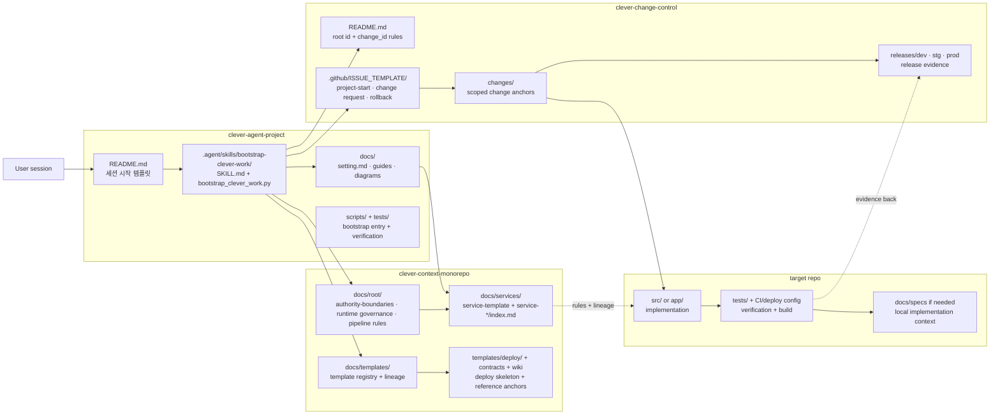

# Three-Repo Control Plane Overview

저장소 화면에서 바로 읽는 용도의 구조도다. `clever-agent-project`가 시작점을 열고, `clever-context-monorepo`가 해석 정본을 제공하고, `clever-change-control`이 root/scoped trace를 남긴 뒤, 실제 구현은 target repo로 넘어간다.

## 읽는 법

- `clever-agent-project`는 사용자 요청을 intake하고 bootstrap packet을 만든다.
- `clever-context-monorepo`는 root rules, service metadata, template lineage를 해석한다.
- `clever-change-control`은 `project-start issue #`와 scoped change를 기록한다.
- 실제 코드와 검증은 target repo에서만 수행된다.
