# 3레포 디렉터리 맵

트리 시점에서 3레포와 대상 레포지토리를 한 번에 보는 구조도다. 저장소 화면에서 바로 훑는 용도라서 레포 루트에서 디렉터리 수준까지 내려가는 모양을 그대로 유지했다.

```mermaid
flowchart TB
    root["CLEVER control plane"]

    root --> ap["clever-agent-project"]
    root --> ctx["clever-context-monorepo"]
    root --> cc["clever-change-control"]
    root --> tr["대상 레포지토리"]

    ap --> ap_readme["README.md"]
    ap --> ap_agent[".agent/skills/bootstrap-clever-work/"]
    ap --> ap_docs["docs/"]
    ap --> ap_scripts["scripts/"]
    ap --> ap_tests["tests/"]

    ap_agent --> ap_skill["SKILL.md"]
    ap_agent --> ap_skill_script["scripts/bootstrap_clever_work.py"]
    ap_docs --> ap_diagrams["docs/diagrams/"]
    ap_docs --> ap_guides["docs/guides/"]
    ap_docs --> ap_super["docs/superpowers/"]
    ap_docs --> ap_templates["docs/templates/"]
    ap_docs --> ap_setting["docs/setting.md"]

    ctx --> ctx_root["docs/root/"]
    ctx --> ctx_services["docs/services/"]
    ctx --> ctx_templates["docs/templates/"]
    ctx --> ctx_wiki["docs/wiki/"]
    ctx --> ctx_deploy["templates/deploy/"]
    ctx --> ctx_contracts["contracts/"]
    ctx --> ctx_placeholders["apps/ + packages/ + services/"]

    ctx_root --> ctx_authority["authority-boundaries.md"]
    ctx_root --> ctx_runtime["agent-runtime-governance.md"]
    ctx_root --> ctx_pipeline["pipeline-governance.md"]
    ctx_services --> ctx_service_template["service-template.md"]
    ctx_services --> ctx_service_docs["service-*/index.md"]
    ctx_templates --> ctx_registry["index.md"]

    cc --> cc_readme["README.md"]
    cc --> cc_issue[".github/ISSUE_TEMPLATE/"]
    cc --> cc_changes["changes/"]
    cc --> cc_releases["releases/"]

    cc_issue --> cc_project_start["project-start.yml"]
    cc_issue --> cc_change_req["change-request.yml"]
    cc_issue --> cc_rollback["rollback-request.yml"]
    cc_releases --> cc_dev["dev/"]
    cc_releases --> cc_stg["stg/"]
    cc_releases --> cc_prod["prod/"]

    tr --> tr_code["src/ 또는 app/"]
    tr --> tr_test["tests/"]
    tr --> tr_ci[".github/ 또는 deploy config/"]
    tr --> tr_docs["docs/ 또는 specs/"]
```

## 포인트

- `clever-agent-project`는 시작 규칙, bootstrap helper, 시나리오 안내를 가진 시작 레포다.
- `clever-context-monorepo`는 실제 내용이 `docs/root`, `docs/services`, `docs/templates`에 집중된 문맥 정본 레포다.
- `clever-change-control`은 구조는 작지만 `project-start`, change request, release evidence를 남기는 ledger 레포다.
- 대상 레포지토리는 control-plane 바깥의 실제 구현 레포다.
