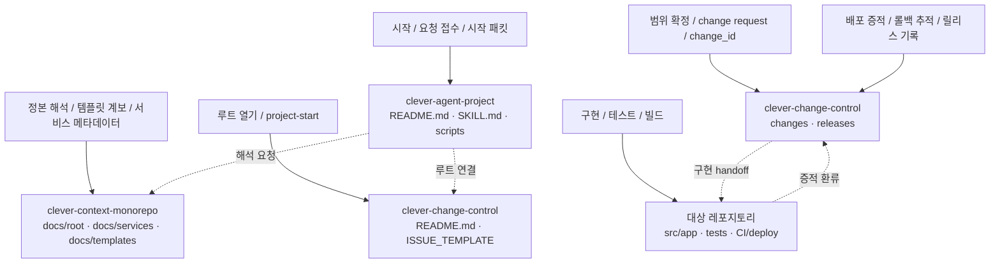

# 3레포 책임 분담도

디렉터리 트리를 그대로 보여주기보다, 각 책임이 어느 레포에 놓여 있는지를 빠르게 읽기 위한 다이어그램이다. 메인 README에는 이 다이어그램을 우선 노출하고, 상세 트리는 별도 문서로 분리한다.

## 읽는 법

- 시작과 요청 접수는 `clever-agent-project`가 맡는다.
- 규칙, 템플릿 계보, 서비스 문맥 해석은 `clever-context-monorepo`가 맡는다.
- `project-start` 루트와 범위가 고정된 변경 추적은 `clever-change-control`이 맡는다.
- 실제 코드 변경과 테스트는 대상 레포지토리에서 수행한다.
- 배포 증적과 롤백 추적은 다시 `clever-change-control`로 환류된다.
