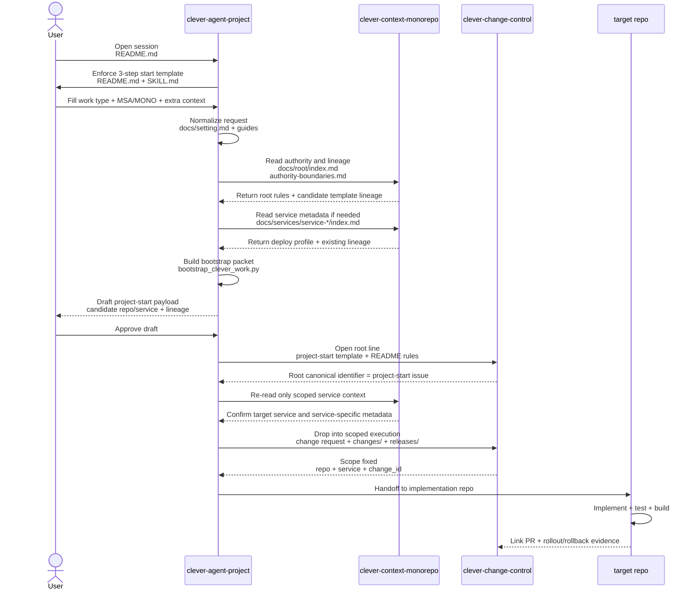

# Session Start To Target-Repo Execution

저장소 화면에서 바로 읽는 용도의 실행 흐름도다. 각 단계마다 어떤 레포와 디렉터리/파일이 관여하는지 같이 본다.

## 단계 요약

1. 시작은 `clever-agent-project/README.md`에서 열린다.
2. 하드 게이트는 `SKILL.md`와 시작 템플릿 규칙으로 강제된다.
3. 해석은 `clever-context-monorepo/docs/root`, `docs/services`, `docs/templates`를 읽어 결정한다.
4. root는 `clever-change-control`의 `project-start issue #`로 열린다.
5. scoped execution은 `change request`, `changes/`, `releases/*`로 내려간다.
6. 구현은 target repo에서 하고, 증적만 다시 change-control로 연결한다.
