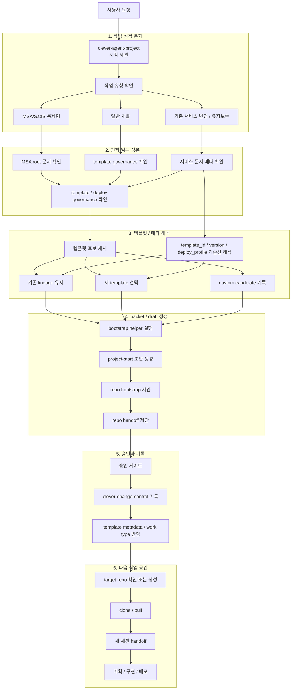

# CLEVER Agent Project Setting

## 이 문서의 역할

이 문서는 `clever-agent-project`를 실제로 운용할 때 필요한 상세 운영 설명서다.

문서 역할은 아래처럼 나뉜다.

- [README.md](../README.md): GitHub 첫 화면용 포털
- `docs/setting.md`: 설치, 인증, bootstrap, 메타 해석, 폴더 역할 설명서
- [docs/guides/clever-project-workflows.md](guides/clever-project-workflows.md): 새 프로젝트 / 기존 repo / 재구현 시나리오 가이드
- [.agent/skills/bootstrap-clever-work/SKILL.md](../.agent/skills/bootstrap-clever-work/SKILL.md): 에이전트 실행 규칙 정본

이 저장소는 `main` 기준 direct push 운영을 기본으로 한다. 승인 후 변경 내용을 `main`에 바로 반영하고, PR은 사용자가 별도로 요청할 때만 사용한다.

## 필수 사전 조건

이 저장소를 실제로 운용하려면 아래 조건이 필요하다.

1. `superpowers`가 설치된 지원 에이전트 런타임 하나
2. `git`
3. `python3`
4. `gh` (GitHub CLI)
5. 같은 workspace root 아래의 `clever-agent-project`, `clever-change-control`, `clever-context-monorepo`

`bootstrap_clever_work.py`는 `git`과 `python3`에 직접 의존한다. 승인 후 실제 운영 흐름은 `gh` 기반의 GitHub 인증, 이슈 생성, repo 생성 또는 확인 작업을 전제로 한다.

## GitHub CLI 설치 및 인증

GitHub CLI는 GitHub 공식 설치 경로를 따르는 것을 권장한다.

- 설치 개요: <https://github.com/cli/cli#installation>
- 명령어 매뉴얼: <https://cli.github.com/manual/>

### macOS

```bash
brew install gh
brew upgrade gh
```

### Windows

```powershell
winget install --id GitHub.cli
winget upgrade --id GitHub.cli
```

### Linux

#### Debian / Ubuntu / Raspberry Pi

```bash
(type -p wget >/dev/null || (sudo apt update && sudo apt install wget -y)) \
  && sudo mkdir -p -m 755 /etc/apt/keyrings \
  && out=$(mktemp) && wget -nv -O "$out" https://cli.github.com/packages/githubcli-archive-keyring.gpg \
  && cat "$out" | sudo tee /etc/apt/keyrings/githubcli-archive-keyring.gpg > /dev/null \
  && sudo chmod go+r /etc/apt/keyrings/githubcli-archive-keyring.gpg \
  && sudo mkdir -p -m 755 /etc/apt/sources.list.d \
  && echo "deb [arch=$(dpkg --print-architecture) signed-by=/etc/apt/keyrings/githubcli-archive-keyring.gpg] https://cli.github.com/packages stable main" | sudo tee /etc/apt/sources.list.d/github-cli.list > /dev/null \
  && sudo apt update \
  && sudo apt install gh -y
```

#### Fedora / RHEL / openSUSE / SUSE 계열

```bash
sudo dnf install dnf5-plugins
sudo dnf config-manager addrepo --from-repofile=https://cli.github.com/packages/rpm/gh-cli.repo
sudo dnf install gh --repo gh-cli
```

DNF4, `yum`, `zypper` 등 다른 공식 RPM 계열 설치 방식은 GitHub CLI Linux 설치 문서를 따른다.

### 인증

기본 인증 흐름은 브라우저 기반 로그인이다.

```bash
gh auth login
gh auth setup-git
gh auth status
```

헤드리스 환경에서는 `GH_TOKEN` 환경 변수 또는 `gh auth login --with-token` 방식을 사용할 수 있다.

## Superpowers 설치

이 저장소는 Codex 전용이 아니다. `superpowers`가 설치된 지원 에이전트 런타임이면 같은 시작 흐름을 사용할 수 있다.

`/.agent` 폴더는 에이전트용 메타데이터를 담는 위치일 뿐이며, 저장소 운영의 필수 실행 체인은 아니다.

### Claude Code Official Marketplace

```bash
/plugin install superpowers@claude-plugins-official
```

### Claude Code (via Plugin Marketplace)

```bash
/plugin marketplace add obra/superpowers-marketplace
/plugin install superpowers@superpowers-marketplace
```

### Cursor (via Plugin Marketplace)

```text
/add-plugin superpowers
```

또는 plugin marketplace에서 `superpowers`를 검색해 설치한다.

### Codex

```text
Fetch and follow instructions from https://raw.githubusercontent.com/obra/superpowers/refs/heads/main/.codex/INSTALL.md
```

세부 문서: <https://github.com/obra/superpowers/blob/main/docs/README.codex.md>

### OpenCode

```text
Fetch and follow instructions from https://raw.githubusercontent.com/obra/superpowers/refs/heads/main/.opencode/INSTALL.md
```

세부 문서: <https://github.com/obra/superpowers/blob/main/docs/README.opencode.md>

### Gemini CLI

```bash
gemini extensions install https://github.com/obra/superpowers
gemini extensions update superpowers
```

지원 런타임에서 subagent 기능이 있다면 켜는 것을 권장하지만, 이 저장소를 시작점으로 쓰기 위한 절대 필수 조건은 아니다.

## Workspace 전제

CLEVER 관련 저장소는 하나의 workspace root 아래에 두는 것을 권장한다.

```text
<CLEVER_ROOT>/
  clever-agent-project/
  clever-change-control/
  clever-context-monorepo/
```

세션은 `<CLEVER_ROOT>/clever-agent-project`에서 시작한다. 승인 후 target GitHub repo를 생성하거나 확인한 다음, 로컬에 clone 또는 pull 하고 그 target repo 루트에서 새 세션을 시작한다.

즉 `superpowers`는 사용자 에이전트 환경에 설치되고, 새 프로젝트 repo는 그 환경 위에서 실행되는 작업 대상 repo가 된다.

## 첫 대화 하드 게이트

새 세션에서 에이전트는 아래 템플릿을 첫 응답 기본값으로 사용한다.

```text
[작업 시작]
1. 새 서비스 개발 vs. 기존 서비스 추가:
2. 서비스 기반 (MSA vs. MONO):
3. 타입 명확하게 분류하기:

추가 설명
- 하려는 일:
- 왜 필요한지:
- 제약:
- 기대 결과:
- 관련 repo/service가 있으면:
```

운영 규칙은 아래와 같다.

- 사용자가 템플릿을 그대로 채워 넣으면 그 값을 그대로 intake로 사용한다.
- 사용자가 자유문으로 시작하면 에이전트가 같은 구조로 다시 정리해 부족한 칸만 묻는다.
- 질문 순서는 항상 `1 -> 2 -> 3`을 먼저 고정한다.
- `change-control`용 `work_type_group`, `work_type_detail`은 사용자가 직접 고르지 않는다. 에이전트가 해석한다.
- 아래가 충분히 채워지기 전에는 다음 단계로 넘어가지 않는다.
  - `1. 새 서비스 개발 vs. 기존 서비스 추가`
  - `2. 서비스 기반 (MSA vs. MONO)`
  - `3. 타입 명확하게 분류하기`
  - `왜 필요한지`
  - `제약`
  - `기대 결과`

즉 시작 템플릿이 먼저고, `project-start` 초안 생성과 repo bootstrap은 그 다음이다.

## 먼저 읽을 문서 순서

작업 성격을 정리하기 전에는 아래 순서를 먼저 따른다.

1. [README.md](../README.md)
2. [.agent/skills/bootstrap-clever-work/SKILL.md](../.agent/skills/bootstrap-clever-work/SKILL.md)
3. [clever-context-monorepo authority boundaries](https://github.com/EVNSolution/clever-context-monorepo/blob/main/docs/root/authority-boundaries.md)
4. [clever-context-monorepo template governance](https://github.com/EVNSolution/clever-context-monorepo/blob/main/docs/root/template-harness-governance.md)
5. [clever-context-monorepo deploy governance](https://github.com/EVNSolution/clever-context-monorepo/blob/main/docs/root/deploy-template-governance.md)
6. [clever-change-control README](https://github.com/EVNSolution/clever-change-control/blob/main/README.md)
7. [clever-change-control project-start issue template](https://github.com/EVNSolution/clever-change-control/blob/main/.github/ISSUE_TEMPLATE/project-start.yml)

이후에는 작업 성격에 따라 추가 문서를 읽는다.

- MSA/SaaS 복제형 작업:
  - [msa-saas-replication-governance.md](https://github.com/EVNSolution/clever-context-monorepo/blob/main/docs/root/msa-saas-replication-governance.md)
  - [clever-msa-platform-workspace.md](https://github.com/EVNSolution/clever-context-monorepo/blob/main/docs/root/clever-msa-platform-workspace.md)
- 유지보수 작업:
  - `clever-context-monorepo/docs/services/<service-name>/index.md`

## 신규 개발 시작 절차

신규 개발은 아래 순서로 진행한다.

1. `clever-agent-project`에서 시작한다.
2. 먼저 세션 시작 템플릿의 `1 -> 2 -> 3` 질문과 추가 설명을 채운다.
3. 에이전트가 답변을 해석해 `MSA/SaaS 복제형`인지 `일반 개발`인지 분기한다.
4. 템플릿 후보를 사용자에게 항상 보여준다.
5. 선택한 템플릿과 배포 프로파일을 기준으로 bootstrap packet을 만든다.
6. `project-start` 초안을 제시하고 승인 게이트를 거친다.
7. 승인 후 `clever-change-control`의 `project-start` root 기록을 만든다.
8. target repo를 제안하거나 확정하고 handoff 한다.

중요한 점은, 신규 개발의 첫 앵커가 `target_service` 고정이 아니라 `템플릿 후보 검토`라는 점과, root canonical identifier가 `change id`가 아니라 `project-start issue #`라는 점이다.

## 기존 서비스 변경 / 유지보수 절차

유지보수는 코드 수정으로 바로 들어가지 않는다. 먼저 서비스 메타를 읽고, 기존 템플릿 계보를 확인한 뒤 진행한다.

기본 절차는 아래와 같다.

1. 먼저 세션 시작 템플릿의 `1 -> 2 -> 3` 질문과 추가 설명을 채운다.
2. 대상 서비스 또는 관련 서비스군을 확인한다.
3. `clever-context-monorepo/docs/services/<service-name>/index.md`를 읽는다.
4. 아래 메타를 확인한다.
   - `template_id`
   - `template_version`
   - `deploy_profile`
   - `override_scope`
   - `lifecycle_state`
5. 같은 계열 유지인지, template migration인지 판단한다.
6. 필요하면 템플릿 후보를 다시 제시한다.
7. root issue 승인 이후 scope가 고정되면 change request 또는 handoff packet을 만든다.

유지보수의 시작점은 코드베이스 해석이 아니라 메타 해석이다.

## 템플릿과 메타 해석 기준

템플릿 관련 기준은 `clever-context-monorepo`가 정본이다.

- template registry: <https://github.com/EVNSolution/clever-context-monorepo/blob/main/docs/templates/index.md>
- template governance: <https://github.com/EVNSolution/clever-context-monorepo/blob/main/docs/root/template-harness-governance.md>
- deploy governance: <https://github.com/EVNSolution/clever-context-monorepo/blob/main/docs/root/deploy-template-governance.md>
- service template: <https://github.com/EVNSolution/clever-context-monorepo/blob/main/docs/services/service-template.md>

각 메타 값은 아래 의미를 가진다.

- `template_id`: 서비스가 어느 템플릿 계열에서 시작했는지
- `template_version`: 실제로 채택한 템플릿 버전
- `deploy_profile`: 이 서비스가 따르는 배포 baseline
- `override_scope`: 고객사별 또는 서비스별 override 허용 범위
- `lifecycle_state`: 현재 서비스나 lineage의 상태

현재 작업에서 수행하려는 변화 종류는 `lifecycle_action`으로 따로 기록한다.

- `adopt`
- `modify`
- `migrate`
- `retire`

기존 템플릿과 다른 template family나 다른 주요 version으로 전환하면 일반 수정이 아니라 `migration`으로 기록한다.

## Bootstrap Helper 사용 예시

아래 helper를 사용해 bootstrap packet과 `project-start` 초안을 만든다.

```bash
python3 scripts/bootstrap_clever_work.py \
  --cwd "$PWD" \
  --template-id "<template id>" \
  --template-version "<version>" \
  --deploy-profile "<deploy profile>" \
  --override-scope "<override scope>" \
  --lifecycle-action "<adopt|modify|migrate|retire>" \
  --json
```

사용자가 목적, 제약, 기대 결과, target repo를 이미 줬다면 함께 넘긴다.

```bash
python3 scripts/bootstrap_clever_work.py \
  --cwd "$PWD" \
  --purpose "<purpose>" \
  --constraints "<constraints>" \
  --expected-result "<expected result>" \
  --target-repo "<target repo if known>" \
  --template-id "<template id>" \
  --template-version "<version>" \
  --deploy-profile "<deploy profile>" \
  --override-scope "<override scope>" \
  --lifecycle-action "<adopt|modify|migrate|retire>" \
  --json
```

일반 intake에서 `change id`와 확정된 `target_service`는 helper 입력 필수값이 아니다. 이 값들은 root issue 승인 후 scoped execution에서 고정한다.

이 helper는 아래 축을 만든다.

- `project_start_issue`
- `repo_bootstrap`
- `repo_session_handoff`
- `ssot_docs_read`

### Markdown으로 이슈 제목/본문 직접 수정하기

이슈 제목과 본문 타입 규칙을 유지하려면 Markdown front matter를 수정한 뒤 동기화 스크립트를 실행한다.

1. 템플릿 복사 또는 기존 draft 파일 수정
   - 템플릿: `docs/templates/issue-edit-template.md`
   - 작업용 draft 파일은 사용자가 원하는 경로에 별도로 만든다.
2. front matter의 아래 필드를 수정
   - `repo`
   - `issue_number`
   - `work_type_group`
   - `work_type_detail`
   - `title`
3. dry-run으로 결과 확인

```bash
python3 scripts/sync_issue_from_md.py <draft-file>.md --dry-run
```

4. 실제 반영

```bash
python3 scripts/sync_issue_from_md.py <draft-file>.md
```

## 폴더별 역할

| 경로 | 열어보는 이유 |
| --- | --- |
| `.agent/skills/bootstrap-clever-work/` | 에이전트가 시작 시 따라야 하는 규칙, helper 위치, bootstrap 자산을 확인할 때 연다. |
| `docs/` | 설정 문서, workflow 가이드, spec/plan 기록, 템플릿 문서를 찾을 때 연다. |
| `scripts/` | bootstrap helper나 issue sync처럼 세션 초기에 직접 실행하는 진입점을 확인할 때 연다. |
| `tests/` | helper와 규칙 문서 변경이 실제 기대 행동을 유지하는지 검증할 때 연다. |

## 관련 문서와 저장소

### 현재 repo

- [README.md](../README.md)
- [docs/guides/clever-project-workflows.md](guides/clever-project-workflows.md)
- [.agent/skills/bootstrap-clever-work/SKILL.md](../.agent/skills/bootstrap-clever-work/SKILL.md)

### SSOT repo

- [clever-context-monorepo](https://github.com/EVNSolution/clever-context-monorepo)
- [clever-change-control](https://github.com/EVNSolution/clever-change-control)

### 외부 템플릿 예시

- [TEST-Erik-project-template](https://github.com/EVNSolution/TEST-Erik-project-template)

## 상세 절차도


