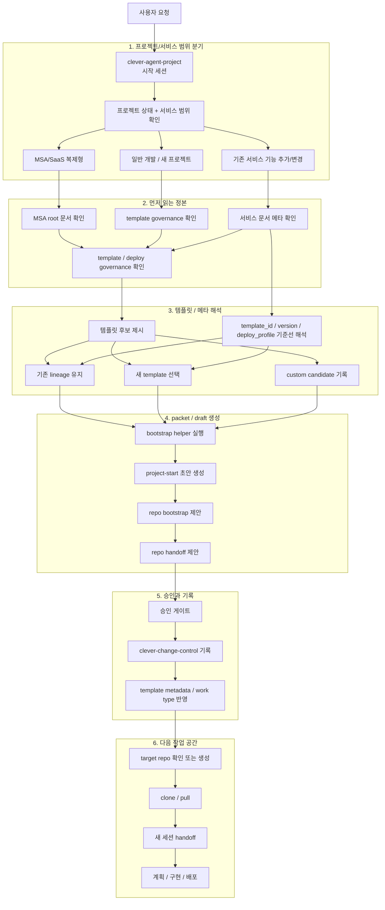

# CLEVER Agent Project Setting

## 이 문서의 역할

이 문서는 `clever-agent-project`를 실제로 운용할 때 필요한 상세 운영 설명서다.

문서 역할은 아래처럼 나뉜다.

- [README.md](../README.md): GitHub 첫 화면용 포털
- `docs/setting.md`: 설치, 인증, bootstrap, 메타 해석, 폴더 역할 설명서
- [docs/guides/clever-project-workflows.md](guides/clever-project-workflows.md): 새 프로젝트 / 기존 repo / 재구현 시나리오 가이드
- [docs/guides/session-start-smoke-test.md](guides/session-start-smoke-test.md): 새 세션 시작 하드 게이트 검증용 운영 시나리오
- [.agent/skills/bootstrap-clever-work/SKILL.md](../.agent/skills/bootstrap-clever-work/SKILL.md): 에이전트 실행 규칙 정본

이 저장소는 작업 시작과 제어 평면 운영을 설명하는 저장소다. target repo의 branch 운영 기준은 `main = deploy`, `dev = work`, `branch = 역할별 작업`을 기본으로 한다.

## 필수 사전 조건

이 저장소를 실제로 운용하려면 아래 조건이 필요하다.

1. `superpowers`가 설치된 지원 에이전트 런타임 하나
2. `git`
3. `python3`
4. `gh` (GitHub CLI)
5. 같은 workspace root 아래의 `clever-agent-project`, `clever-change-control`, `clever-context-monorepo`

`bootstrap_clever_work.py`는 `git`과 `python3`에 직접 의존한다. 승인 후 실제 운영 흐름은 `gh` 기반의 GitHub 인증, 이슈 생성, repo 생성 또는 확인 작업을 전제로 한다.

## GitHub CLI 설치 및 인증

GitHub CLI는 GitHub 공식 설치 경로를 따르는 것을 권장한다.

- 설치 개요: <https://github.com/cli/cli#installation>
- 명령어 매뉴얼: <https://cli.github.com/manual/>

### macOS

```bash
brew install gh
brew upgrade gh
```

### Windows

```powershell
winget install --id GitHub.cli
winget upgrade --id GitHub.cli
```

### Linux

#### Debian / Ubuntu / Raspberry Pi

```bash
(type -p wget >/dev/null || (sudo apt update && sudo apt install wget -y)) \
  && sudo mkdir -p -m 755 /etc/apt/keyrings \
  && out=$(mktemp) && wget -nv -O "$out" https://cli.github.com/packages/githubcli-archive-keyring.gpg \
  && cat "$out" | sudo tee /etc/apt/keyrings/githubcli-archive-keyring.gpg > /dev/null \
  && sudo chmod go+r /etc/apt/keyrings/githubcli-archive-keyring.gpg \
  && sudo mkdir -p -m 755 /etc/apt/sources.list.d \
  && echo "deb [arch=$(dpkg --print-architecture) signed-by=/etc/apt/keyrings/githubcli-archive-keyring.gpg] https://cli.github.com/packages stable main" | sudo tee /etc/apt/sources.list.d/github-cli.list > /dev/null \
  && sudo apt update \
  && sudo apt install gh -y
```

#### Fedora / RHEL / openSUSE / SUSE 계열

```bash
sudo dnf install dnf5-plugins
sudo dnf config-manager addrepo --from-repofile=https://cli.github.com/packages/rpm/gh-cli.repo
sudo dnf install gh --repo gh-cli
```

DNF4, `yum`, `zypper` 등 다른 공식 RPM 계열 설치 방식은 GitHub CLI Linux 설치 문서를 따른다.

### 인증

기본 인증 흐름은 브라우저 기반 로그인이다.

```bash
gh auth login
gh auth setup-git
gh auth status
```

헤드리스 환경에서는 `GH_TOKEN` 환경 변수 또는 `gh auth login --with-token` 방식을 사용할 수 있다.
공용 CLEVER 기본 계정은 없다. 첫 실행 때는 gh CLI에서 GitHub 계정이 확인되면 별도로 묻지 않는다. 계정을 확인할 수 없거나 다른 계정으로 고정해야 할 때만 사용자에게 GitHub login 또는 profile URL을 물어보고 `CLEVER_EXPECTED_GITHUB_LOGIN` 또는 `--expected-github-login`으로 명시한다.
preflight는 `EVNSolution` org active membership도 확인한다.

## Superpowers 설치

이 저장소는 Codex 전용이 아니다. `superpowers`가 설치된 지원 에이전트 런타임이면 같은 시작 흐름을 사용할 수 있다.

`/.agent` 폴더는 에이전트용 메타데이터를 담는 위치일 뿐이며, 저장소 운영의 필수 실행 체인은 아니다.

### Claude Code Official Marketplace

```bash
/plugin install superpowers@claude-plugins-official
```

### Claude Code (via Plugin Marketplace)

```bash
/plugin marketplace add obra/superpowers-marketplace
/plugin install superpowers@superpowers-marketplace
```

### Cursor (via Plugin Marketplace)

```text
/add-plugin superpowers
```

또는 plugin marketplace에서 `superpowers`를 검색해 설치한다.

### Codex

```text
Fetch and follow instructions from https://raw.githubusercontent.com/obra/superpowers/refs/heads/main/.codex/INSTALL.md
```

세부 문서: <https://github.com/obra/superpowers/blob/main/docs/README.codex.md>

### OpenCode

```text
Fetch and follow instructions from https://raw.githubusercontent.com/obra/superpowers/refs/heads/main/.opencode/INSTALL.md
```

세부 문서: <https://github.com/obra/superpowers/blob/main/docs/README.opencode.md>

### Gemini CLI

```bash
gemini extensions install https://github.com/obra/superpowers
gemini extensions update superpowers
```

지원 런타임에서 subagent 기능이 있다면 켜는 것을 권장하지만, 이 저장소를 시작점으로 쓰기 위한 절대 필수 조건은 아니다.

## Workspace 전제

CLEVER 관련 저장소는 하나의 workspace root 아래에 두는 것을 권장한다.

```text
<CLEVER_ROOT>/
  clever-agent-workspace/
    clever-agent-project/
    clever-change-control/
    clever-context-monorepo/
  projects/
    <target-repo>/
```

`<CLEVER_ROOT>`는 전체 CLEVER 작업 루트다. 에이전트 제어 평면은 `<CLEVER_ROOT>/clever-agent-workspace/`이고, 3대 레포는 항상 그 안의 sibling으로 둔다.
실제 제품/서비스 원격 repo는 `<CLEVER_ROOT>/projects/<target-repo>/`
아래에 clone 또는 pull 한다. 새 target repo seed 파일은 이 target repo 루트에 주입한다.

generic CLEVER startup 세션은 `<CLEVER_ROOT>/clever-agent-workspace/clever-agent-project`에서 시작한다. 승인 후 target GitHub repo를 생성하거나 확인한 다음, `<CLEVER_ROOT>/projects/` 아래에 로컬 clone 또는 pull 하고 그 target repo 루트에서 새 세션을 시작한다.

예외는 sibling control-plane repo 자체를 직접 수정하는 경우다.

- `clever-context-monorepo` 정본 문서 수정
- `clever-change-control` issue template 또는 traceability 규칙 수정

이 경우에는 해당 레포에서 세션을 열 수 있지만, 먼저 `preflight`로 generic startup이 아니라 repo-local maintenance인지 확인해야 한다.

즉 `superpowers`는 사용자 에이전트 환경에 설치되고, 새 프로젝트 repo는 그 환경 위에서 실행되는 작업 대상 repo가 된다.

## Control-plane Repo 보호 기준

아래 3개 control-plane repo는 public으로 운영한다.

- `clever-agent-project`
- `clever-context-monorepo`
- `clever-change-control`

각 repo의 `main`은 GitHub ruleset `CLEVER protect main`으로 보호한다.

- `main` direct push 금지
- `main` 삭제 금지
- force push 금지
- `main` 변경은 PR 필수
- PR 승인 수는 0명
- admin bypass는 `pull_request` 모드만 허용한다.

control-plane repo 자체를 수정할 때도 `main`에 직접 push하지 않는다.
역할 접두사 branch에서 작업하고 PR로 올린다.

## Target Repo 브랜치 운영 기준

target repo를 처음 remote에 올릴 때는 아래 순서를 기본으로 한다.

1. 새 target repo는 public으로 생성한다.
2. brand-new remote bootstrap이면 초기 commit은 `main`에 올릴 수 있다.
3. 초기 remote publish가 끝나면 바로 `dev` branch를 만든다.
4. `dev`가 push된 뒤 admin preflight를 통과하고 GitHub ruleset을 적용한다.
5. 이후 일상 작업은 `dev` 또는 `dev`에서 파생된 task branch에서 한다.
6. `dev`가 생긴 뒤에는 로컬에서 `main` direct push를 막는다.

새 repo 생성 명령은 아래 형태를 기본으로 한다.

```bash
gh repo create <owner>/<repo> --public
```

GitHub Free 조직에서 private repo ruleset이 enforce되지 않는다.
private repo ruleset enforce가 필요하면 GitHub Team, GitHub Pro, 또는 GitHub Enterprise Cloud로 업그레이드가 필요하다.

브랜치 의미는 아래처럼 고정한다.

- `main = deploy`
- `dev = work`
- `branch = 역할별 작업`

작업 원칙은 아래다.

- 작은 작업이나 긴급 수정은 `dev`에 직접 작업할 수 있다.
- 기본 추천은 작업 단위별 branch를 만드는 것이다.
- task branch는 보통 `dev`에서 분기한다.
- 이미 진행 중인 task branch 아래에서 세부 역할을 더 쪼개야 하면 child branch를 만들어도 된다.

즉 `dev`는 통합 작업선이고, task branch는 역할별 작업선이다.

### PR Scope Grouping Gate

PR은 파일 수가 아니라 변경 축과 검증 단위로 나눈다.

같은 issue 안에서 same document/operating-rule cleanup 축이고 same validation command로
충분하면 한 PR로 묶는다. `AGENTS.md`, PR template, startup state
template, project brief template, design source policy, merge title template
sync처럼 같은 운영 규칙을 맞추는 작은 문서 정리는 여러 PR로 나누지 않는다.
나누면 리뷰 단위보다 추적 단위가 커지고, issue 연결과 context completion
기록만 반복된다.

분리 PR은 아래 경우에만 기본값으로 둔다.

- different app/service/contract surface를 건드린다.
- 테스트 범위와 실패 지점이 다르다.
- merge order dependency가 있다.
- 실패 시 rollback unit이 다르다.

예: OpenAPI schema 변경, Admin Web smoke 화면 구현, Rider App smoke 화면 구현,
Spring service mock endpoint 구현은 검증과 실패 지점이 달라 보통 분리한다.

### PR 완료 후 branch 정리

PR이 merge됐거나 source branch를 버리기로 하고 closed 처리된 뒤에는 task
branch를 정리한다. 단, 해당 branch가 아직 open PR, 후속 issue, child branch,
active release/hotfix에 쓰이면 삭제하지 않는다.

기본 명령은 아래 순서다.

```bash
git switch dev
git pull --ff-only origin dev
git branch -d <source-branch>
git push origin --delete <source-branch>
git fetch --prune origin
```

- `main`과 `dev`는 삭제 대상이 아니다.
- 기본은 `git branch -d <source-branch>`를 쓴다.
- merge 없이 닫은 branch를 폐기해야 할 때만 사용자 확인 후 `git branch -D <source-branch>`를 쓴다.
- remote branch가 GitHub에서 이미 삭제됐더라도 `git fetch --prune origin`으로 로컬 추적 branch를 정리한다.

### GitHub ruleset 적용

새 target repo에는 seed file로 `scripts/apply-github-rulesets.sh`를 복사한다.
초기 `main` commit과 `dev` push가 끝난 뒤 먼저 admin preflight를 실행한다.

```bash
python3 scripts/bootstrap_clever_work.py \
  --cwd "$PWD" \
  --admin-preflight \
  --target-repo-full-name <owner>/<repo> \
  --json
```

통과하면 아래처럼 ruleset을 적용한다.

```bash
chmod +x scripts/apply-github-rulesets.sh
scripts/apply-github-rulesets.sh <owner>/<repo>
```

표준 ruleset은 GitHub repository rulesets API를 사용해 아래 두 branch에만 적용한다.

- `main`: PR 경유만 허용하고 direct push를 막는다. 승인 수는 0명이다.
- `dev`: PR 경유만 허용하고 direct push를 막는다. 승인 수는 0명이다.
- 그 외 branch: GitHub ruleset을 적용하지 않는다.

이 작업에는 `gh auth status` 통과, 사용자가 제공한 GitHub login 또는 profile URL 검증, `EVNSolution` org membership, target repo의 GitHub Administration write 권한이 필요하다.
새 repo 생성 권한은 destructive create 없이 완전히 증명할 수 없으므로, preflight는 membership과 API 접근을 먼저 확인하고 실제 생성 성공은 `gh repo create` 결과로 확정한다.

### 로컬 `main` push 금지 가드

`dev`를 만든 뒤에는 target repo 로컬에서 `main` direct push를 막는 것을 권장한다.

권장 방식은 repo-local `pre-push` hook이다.

예시:

```bash
cat > .git/hooks/pre-push <<'EOF'
#!/bin/sh
branch="$(git rev-parse --abbrev-ref HEAD)"
if [ "$branch" = "main" ]; then
  echo "Direct pushes to main are blocked locally. Use dev or a task branch."
  exit 1
fi
EOF
chmod +x .git/hooks/pre-push
```

이 가드는 local repo 단위로만 적용된다. 다른 저장소까지 자동으로 막지는 않는다.

### dev/main PR review completion

`dev` 또는 `main`으로 들어가는 PR merge 단위에서 검토 에이전트 작업은 wiki/service context 업데이트로 끝난다.
이슈 종료는 PR 검토 완료 결과를 참조한다.
PR 정보를 wiki에 올리는 것이 아니다. wiki에는 필요한 서비스/운영 context만 반영한다.

따라서 에이전트는 `dev`/`main` PR 준비 시 아래도 함께 본다.

- `clever-context-monorepo/docs/services/<service>/index.md` 갱신 필요 여부
- `clever-context-monorepo/docs/wiki/` 탐색 문서 또는 요약 문서 갱신 필요 여부
- template lineage, deploy profile, env/secret category, public contract 변화가 service 문서에 반영됐는지
- 검토 에이전트의 wiki/service context update result, service doc update, wiki update, clever-context-monorepo update

복사해 쓰는 프롬프트는 아래 문서에 둔다.

- [PR review context/wiki completion prompt](templates/main-pr-global-context-wiki-prompt.md)

### 이슈 해결 단위의 컨텍스트 wiki 정리

각 이슈를 해결 완료로 표시하기 전에도 `clever-context-monorepo` 반영 필요 여부를 확인한다.
단, 연결된 `dev` 또는 `main` PR이 있으면 context/wiki 판단과 업데이트는 PR 검토 에이전트 작업의 마지막 단계로 처리한다.

에이전트는 이슈 종료 코멘트, PR 정리, merge 준비를 작성하기 전에 아래를 점검한다.

- `clever-context-monorepo/docs/services/<service>/index.md` 갱신 필요 여부
- `clever-context-monorepo/docs/wiki/` 탐색 문서 또는 요약 문서 갱신 필요 여부
- public contract, deploy/runtime 기준, env/secret category, 운영 caveat가 정본 문서에 반영됐는지

복사해 쓰는 프롬프트는 아래 문서에 둔다.

- [issue resolution context wiki prompt](templates/issue-resolution-context-wiki-prompt.md)

이 점검은 모든 이슈에서 수행하지만, 모든 이슈가 wiki 수정으로 이어지는 것은 아니다. 서비스 정본은 service 문서에 우선 반영하고, `docs/wiki/`는 빠른 탐색이나 요약이 필요할 때만 수정한다.
이슈 종료 코멘트는 PR 검토 완료 결과의 context/wiki 결과를 복사하거나 링크한다.

### 새 target repo 초기 seed 파일

새 target repo를 만들거나 첫 target repo를 bootstrap할 때는 프로젝트 기획 초안과 agent 실행 절차서를 분리해서 넣는다. 주입 위치는 `<CLEVER_ROOT>/projects/<target-repo>/`에 clone/pull된 target repo 루트다.

- [target repo AGENTS template](templates/target-repo-AGENTS.md) -> target repo `AGENTS.md`
- [target repo project brief template](templates/target-repo-project-brief.md) -> target repo `docs/project-brief.md`
- [target repo PR template](templates/target-repo-PULL_REQUEST_TEMPLATE.md) -> target repo `.github/PULL_REQUEST_TEMPLATE.md`

`AGENTS.md`는 프로젝트 설명서가 아니다. agent가 따라야 할 작업 순서, branch/issue 연결 방식, 테스트와 검증 순서, context 문서 반영 기준, 완료 조건을 담는다.
또한 target repo에서 실행할 수 있는 branch role prefix 강제 hook 설치 명령을 포함한다.

첫 main push 전에는 target repo 루트 `AGENTS.md`가 `docs/templates/target-repo-AGENTS.md`에서 복사되어 initial commit에 포함되는지 반드시 확인한다. 누락, 빈 파일, stage 누락 상태이면 먼저 seed 파일을 복사/stage하고 `git status --short`, `git diff --cached -- AGENTS.md`로 확인하기 전에는 push하지 않는다.

`docs/project-brief.md`는 프로젝트 기획 초안이다. 목적, 기대 결과, 제약, 초기 범위, 미정 사항, 다음 작업 목록을 담는다.

bootstrap packet의 `target_repo_seed_files` 항목은 위 두 파일을 target repo에 복사하라는 handoff 지시다. 확정되지 않은 placeholder는 추측해서 채우지 말고 `pending` 또는 빈 값으로 남긴다.

## 첫 대화 하드 게이트

첫 질문을 던지기 전에 에이전트는 먼저 gh CLI에서 GitHub 계정을 확인하고 로컬 workspace, `gh auth status`, GitHub login, 원격 접근, issue/PR/ruleset 조회 가능 여부를 자동 감지한다. gh CLI에서 GitHub 계정이 확인되면 별도로 묻지 않는다. 계정을 확인할 수 없거나 다른 계정으로 고정해야 할 때만 사용자에게 GitHub login 또는 profile URL을 물어본다.

```bash
python3 scripts/bootstrap_clever_work.py --cwd "$PWD" --preflight --json
```

현재 control-plane 저장소 자체를 직접 수정하는 세션이면 아래처럼 유지보수 모드로 확인한다.

```bash
python3 scripts/bootstrap_clever_work.py --cwd "$PWD" --preflight --current-repo-maintenance --json
```

`preflight_check.ready=false`이면 시작 질문으로 내려가지 않고 실패한 check를 먼저 해결한다.
이때 `recovery_actions`에 실패 check별 복구 명령이나 처리 지시가 들어간다.
`auto_skipped_questions`는 도구가 이미 답한 질문이므로 다시 묻지 않는다.
`next_questions`는 자동 확인 뒤에도 남아 있는 최소 사용자 질문만 담는다.
`preflight_check.agent_response_contract`는 `<CLEVER_ROOT>`에서 프롬프트를 받았을 때
에이전트가 어떻게 첫 답변을 해야 하는지 고정한다. 바로 구현하지 말고
에이전트 기반 절차를 전수받아 preflight, repo 확인/생성, ruleset 확인/생성,
pull/clone, target repo agent 문서 주입을 먼저 끝낸 뒤 "초기 작업이 완료됐고,
다음 작업은 주신 프롬프트대로 진행하겠다"는 형태로 답한다.

`workspace_check.session_open_check`는 Python preflight가 현재 세션이
`<CLEVER_ROOT>` 기준으로 열렸는지 확인한 결과다. `pass`이면
`<CLEVER_ROOT>/clever-agent-workspace/`와 `<CLEVER_ROOT>/projects/` 구조가 맞다.
`legacy-layout`이면 기존 direct control-plane layout에서 실행 중이라는 뜻이므로
새 target repo는 반드시 `<CLEVER_ROOT>/projects/<target-repo>/`에
둔다. `fail`이면 작업 질문으로 내려가기 전에 세션 위치를 먼저 고친다.

`true`이면 내부 `workspace_check.agent_action`이 아래 중 하나를 돌려준다.

- `proceed-with-hard-gate`: 현재 위치에서 시작 템플릿으로 진행
- `current-repo-maintenance`: 현재 control-plane 저장소 자체를 수정하는 세션으로 보고 여기서 계속
- `switch-to-clever-agent-project`: `clever-agent-project`에서 다시 시작
- `stop-and-fix-workspace`: 3레포 로컬 workspace가 불완전하므로 먼저 보완

새 세션에서 에이전트는 아래 템플릿을 첫 응답 기본값으로 사용한다.

```text
[시작 분기]
먼저 하려는 일을 한 줄로 적어 주세요.
선택지에 맞춰 답해도 되고, 애매하면 문장으로 편하게 설명해도 됩니다.

- 하려는 일:

아래 항목은 모르면 `아직 모름`으로 둬도 됩니다.
각 항목은 선택지 중 하나를 골라도 되고, 선택지에 딱 맞지 않으면 직접 설명해도 됩니다.

1. 작업 성격은 어디에 가깝나요?
- 신규 개발
- 기존 기능 확장/수정
- 버그 수정
- 리팩터링/구조 개선
- 문서/설정/운영 정리
- 아직 모름
- 직접 설명:

2. 대상 범위는 무엇인가요?
- 새 앱/서비스/기능
- 기존 앱/서비스/기능
- 화면/UI
- API
- DB/model
- CI/CD 또는 배포 workflow
- 문서/운영 설정
- 아직 모름
- 직접 설명:

3. 이번 작업의 목표 수준은 어디까지인가요?
- 요구사항 정리
- 설계 문서 작성
- 구현 계획 수립
- 실제 코드 변경
- 테스트/검증
- 배포/운영 준비
- 1차 MVP 개발 및 배포
- 운영 반영
- 아직 모름
- 직접 설명:

4. 알고 있는 이름이나 링크가 있나요? 없으면 비워도 됩니다.
- repo:
- service/app:
- 화면:
- API:
- DB/model:
- 문서:
- issue/PR/Figma/회의 메모/에러 로그:

5. 현재 상태를 알고 있나요? 모르면 `아직 모름`으로 둬도 됩니다.
- 이미 되어 있는 것:
- 아직 없는 것:
- 먼저 확인해야 할 것:

6. 주의할 점이 있나요? 없으면 비워도 됩니다.
- 꼭 지킬 것:
- 피할 것:
- 건드리면 안 되는 범위:
- 보안/운영/배포 관련 주의사항:
```

운영 규칙은 아래와 같다.

- 사용자가 템플릿을 그대로 채워 넣으면 그 값을 그대로 intake로 사용한다.
- 사용자가 자유문으로 시작하면 에이전트가 같은 구조로 다시 정리해 부족한 칸만 묻는다.
- 질문 순서는 항상 `하려는 일 -> 작업 성격 -> 대상 범위 -> 목표 수준`을 먼저 고정한다.
- `4. 알고 있는 이름이나 링크`, `5. 현재 상태`, `6. 주의할 점`은 있으면 받되, 사용자가 모르면 비워 둔다.
- MONO/MSA, `target_service`, rollout scope 같은 전문 용어는 첫 입력에서 묻지 않는다.
- `change-control`용 `work_type_group`, `work_type_detail`은 사용자가 직접 고르지 않는다. 에이전트가 해석한다.
- 아래가 충분히 채워지기 전에는 다음 단계로 넘어가지 않는다.
  - `하려는 일`
  - `1. 작업 성격은 어디에 가깝나요?`
  - `2. 대상 범위는 무엇인가요?`
  - `3. 이번 작업의 목표 수준은 어디까지인가요?`

에이전트는 이 응답을 바로 narrative로 넘기지 않고, 먼저 아래 템플릿으로 정규화해야 한다.

- [startup branch state template](templates/startup-branch-state-template.md)

즉 시작 템플릿이 먼저고, `project-start` 초안 생성과 repo bootstrap은 그 다음이다.

시작 게이트가 실제로 잘 걸리는지 확인하려면 [세션 시작 스모크 테스트 시나리오](guides/session-start-smoke-test.md)를 먼저 따라 본다.
현재 정본 기준, 어긋나는 문구, 덜 작성된 항목은 [3레포 시작 모델 정합성 정리](guides/three-repo-startup-alignment.md)에서 본다.

## 먼저 읽을 문서 순서

작업 성격을 정리하기 전에는 아래 순서를 먼저 따른다.

아래 링크는 GitHub mirror 기준으로 걸려 있지만, 실제 authority 판단은 같은 로컬 workspace 안의 sibling repo 파일을 우선으로 본다.

1. [README.md](../README.md)
2. [.agent/skills/bootstrap-clever-work/SKILL.md](../.agent/skills/bootstrap-clever-work/SKILL.md)
3. [clever-context-monorepo authority boundaries](https://github.com/EVNSolution/clever-context-monorepo/blob/main/docs/root/authority-boundaries.md)
4. [clever-context-monorepo template governance](https://github.com/EVNSolution/clever-context-monorepo/blob/main/docs/root/template-harness-governance.md)
5. [clever-context-monorepo deploy governance](https://github.com/EVNSolution/clever-context-monorepo/blob/main/docs/root/deploy-template-governance.md)
6. [clever-change-control README](https://github.com/EVNSolution/clever-change-control/blob/main/README.md)
7. [clever-change-control project-start issue template](https://github.com/EVNSolution/clever-change-control/blob/main/.github/ISSUE_TEMPLATE/project-start.yml)

이후에는 작업 성격에 따라 추가 문서를 읽는다.

- MSA/SaaS 복제형 작업:
  - [msa-saas-replication-governance.md](https://github.com/EVNSolution/clever-context-monorepo/blob/main/docs/root/msa-saas-replication-governance.md)
  - [clever-msa-platform-workspace.md](https://github.com/EVNSolution/clever-context-monorepo/blob/main/docs/root/clever-msa-platform-workspace.md)
- 유지보수 작업:
  - `clever-context-monorepo/docs/services/<service-name>/index.md`

## 새 프로젝트 / 새 서비스 시작 절차

새 프로젝트 또는 새 서비스 시작은 아래 순서로 진행한다.

1. `clever-agent-project`에서 시작한다.
2. 먼저 세션 시작 템플릿의 `하려는 일 -> 작업 성격 -> 대상 범위 -> 목표 수준` 질문을 채우고, 이름/링크/현재상태/주의사항은 아는 만큼만 적는다.
3. 에이전트가 쉬운 답변을 `work_nature`, `target_scope`, `goal_level`로 정규화한 뒤 `project_scope`, `service_scope`, `session_goal`을 파생하고, 구조는 repo/context를 읽은 뒤 `MSA/SaaS 복제형`인지 `일반 개발`인지 분기한다.
4. 템플릿 후보를 사용자에게 항상 보여준다.
5. 선택한 템플릿과 배포 프로파일을 기준으로 bootstrap packet을 만든다.
6. `project-start` 초안을 제시하고 승인 게이트를 거친다.
7. 승인 후 `clever-change-control`의 `project-start` root 기록을 만든다.
8. target repo를 제안하거나 확정하고 handoff 한다.

중요한 점은, 새 프로젝트/서비스의 첫 앵커가 `target_service` 고정이 아니라 `프로젝트 상태 + 서비스 범위 + 템플릿 후보 검토`라는 점과, root canonical identifier가 `change id`가 아니라 `project-start issue #`라는 점이다.

## 기존 프로젝트 / 기존 서비스 변경·유지보수 절차

기존 프로젝트나 기존 서비스 변경은 코드 수정으로 바로 들어가지 않는다. 먼저 서비스 메타를 읽고, 기존 템플릿 계보를 확인한 뒤 진행한다.

기본 절차는 아래와 같다.

1. 먼저 세션 시작 템플릿의 `하려는 일 -> 작업 성격 -> 대상 범위 -> 목표 수준` 질문을 채우고, 이름/링크/현재상태/주의사항은 아는 만큼만 적는다.
2. 대상 서비스 또는 관련 서비스군을 확인한다.
3. `clever-context-monorepo/docs/services/<service-name>/index.md`를 읽는다.
4. 아래 메타를 확인한다.
   - `template_id`
   - `template_version`
   - `deploy_profile`
   - `override_scope`
   - `lifecycle_state`
5. 같은 계열 유지인지, template migration인지 판단한다.
6. 필요하면 템플릿 후보를 다시 제시한다.
7. root issue 승인 이후 scope가 고정되면 change request 또는 handoff packet을 만든다.

유지보수의 시작점은 코드베이스 해석이 아니라 메타 해석이다.

## 템플릿과 메타 해석 기준

템플릿 관련 기준은 `clever-context-monorepo`가 정본이다.

- template registry: <https://github.com/EVNSolution/clever-context-monorepo/blob/main/docs/templates/index.md>
- template governance: <https://github.com/EVNSolution/clever-context-monorepo/blob/main/docs/root/template-harness-governance.md>
- deploy governance: <https://github.com/EVNSolution/clever-context-monorepo/blob/main/docs/root/deploy-template-governance.md>
- service template: <https://github.com/EVNSolution/clever-context-monorepo/blob/main/docs/services/service-template.md>

각 메타 값은 아래 의미를 가진다.

- `template_id`: 서비스가 어느 템플릿 계열에서 시작했는지
- `template_version`: 실제로 채택한 템플릿 버전
- `deploy_profile`: 이 서비스가 따르는 배포 baseline
- `override_scope`: 고객사별 또는 서비스별 override 허용 범위
- `lifecycle_state`: 현재 서비스나 lineage의 상태

현재 작업에서 수행하려는 변화 종류는 `lifecycle_action`으로 따로 기록한다.

- `adopt`
- `modify`
- `migrate`
- `retire`

기존 템플릿과 다른 template family나 다른 주요 version으로 전환하면 일반 수정이 아니라 `migration`으로 기록한다.

## Bootstrap Helper 사용 예시

아래 helper를 사용해 bootstrap packet과 `project-start` 초안을 만든다.

```bash
python3 scripts/bootstrap_clever_work.py \
  --cwd "$PWD" \
  --template-id "<template id>" \
  --template-version "<version>" \
  --deploy-profile "<deploy profile>" \
  --override-scope "<override scope>" \
  --lifecycle-action "<adopt|modify|migrate|retire>" \
  --json
```

사용자가 목적, 제약, 기대 결과, target repo를 이미 줬다면 함께 넘긴다.

```bash
python3 scripts/bootstrap_clever_work.py \
  --cwd "$PWD" \
  --purpose "<purpose>" \
  --constraints "<constraints>" \
  --expected-result "<expected result>" \
  --target-repo "<target repo if known>" \
  --template-id "<template id>" \
  --template-version "<version>" \
  --deploy-profile "<deploy profile>" \
  --override-scope "<override scope>" \
  --lifecycle-action "<adopt|modify|migrate|retire>" \
  --json
```

일반 intake에서 `change id`와 확정된 `target_service`는 helper 입력 필수값이 아니다. 이 값들은 root issue 승인 후 scoped execution에서 고정한다.

이 helper는 아래 축을 만든다.

- `project_start_issue`
- `repo_bootstrap`
- `repo_session_handoff`
- `ssot_docs_read`

### Markdown으로 이슈 제목/본문 직접 수정하기

이슈 제목과 본문 타입 규칙을 유지하려면 Markdown front matter를 수정한 뒤 동기화 스크립트를 실행한다.

1. 템플릿 복사 또는 기존 draft 파일 수정
   - 템플릿: `docs/templates/issue-edit-template.md`
   - 작업용 draft 파일은 사용자가 원하는 경로에 별도로 만든다.
2. front matter의 아래 필드를 수정
   - `repo`
   - `issue_number`
   - `work_type_group`
   - `work_type_detail`
   - `title`
3. dry-run으로 결과 확인

```bash
python3 scripts/sync_issue_from_md.py <draft-file>.md --dry-run
```

4. 실제 반영

```bash
python3 scripts/sync_issue_from_md.py <draft-file>.md
```

## 폴더별 역할

| 경로 | 열어보는 이유 |
| --- | --- |
| `.agent/skills/bootstrap-clever-work/` | 에이전트가 시작 시 따라야 하는 규칙, helper 위치, bootstrap 자산을 확인할 때 연다. |
| `docs/` | 설정 문서, workflow 가이드, spec/plan 기록, 템플릿 문서를 찾을 때 연다. |
| `scripts/` | bootstrap helper나 issue sync처럼 세션 초기에 직접 실행하는 진입점을 확인할 때 연다. |
| `tests/` | helper와 규칙 문서 변경이 실제 기대 행동을 유지하는지 검증할 때 연다. |

## 관련 문서와 저장소

### 현재 repo

- [README.md](../README.md)
- [docs/guides/clever-project-workflows.md](guides/clever-project-workflows.md)
- [.agent/skills/bootstrap-clever-work/SKILL.md](../.agent/skills/bootstrap-clever-work/SKILL.md)

### SSOT repo

- [clever-context-monorepo](https://github.com/EVNSolution/clever-context-monorepo)
- [clever-change-control](https://github.com/EVNSolution/clever-change-control)

### 외부 템플릿 예시

- [TEST-Erik-project-template](https://github.com/EVNSolution/TEST-Erik-project-template)

## 상세 절차도


